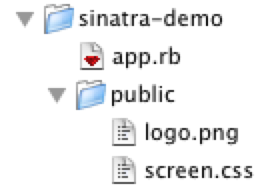
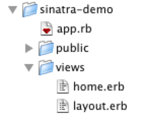

!SLIDE subsection

# Digging Deeper #

!SLIDE bullets

* Static Files
* Templates
* Helpers

!SLIDE center

# Static Files

	
!SLIDE center

# Templates

!SLIDE

	@@@ ruby
	get '/hello/:name' do
		@name = params[:name]
		erb :hello
	end

!SLIDE code

# views/hello.erb

	@@@ html
	

		Hello <%= @name %>
	

!SLIDE code small

# views/layout.erb

	@@@ html
	<!DOCTYPE html>
	<html>
		<head>
			<title>Demo App</title>
			<link rel="stylesheet" type="text/css"
				href="/screen.css">
		</head>
		<body>
			<%= yield %>
		</body>
	</html>

!SLIDE code

# views/hello.erb

	@@@ html
	

		Hello <%= @name %>. 
		The time is <%= current_time %>
	

!SLIDE

	@@@ ruby
	helpers do
		def current_time
			Time.now.strftime('%h:%m')
		end
	end